:mod:`Wizard` --- Creating a BRisa Project 
==========================================

.. module: wizard
    :synopsis: Wizard generate a Brisa Project code

About Qt BRisa Wizard Application
--------------------------------
Qt BRisa Wizard Application is capable of creating Devices and ControlPoints projects using only a few information about device and service (e.g. device's constants, services' actions, actions arguments).

User should inform the project and device names. 
	 
The name you choose for the project will be the name of the directory where Devices and ControlPoints directories related to this project will be created.
	 
The user doesn't need to inform the controlPoint's name, it will be defined as the following: 
::
		device_name + "ControlPoint" 

When in description page, user will need to inform the required constants values or accept default ones.

In Services Definition page, the user may inform which services will be added to the device and Qt BRisa wizard application will create a header, a source and a xml file for each service.

It is not allowed that any action has arguments or stateVariables names repeated when defining its parameters. However, distinct actions may have the same argument or stateVariable name (as in the Calculator example). 
	 
	
The field DefaultValue is not mandatory. This line will be ignored in xml file if not defined.

	
The modification of  Type or DefaultValue from some StateVariable used in distinct actions causes that modification to happen in all actions that make use of this StateVariable. This happens because the StateVariable belongs to Service, not to a specific action. 

The generated code is currently compiled by Qt 4.6.2 version and QtCreator version 2.0.1 and earlier. 

It's possible to automatically repeat the arguments and stateVariables from one action to all other actions using the button "repeat arguments". Any arguments or stateVariables defined in the others actions, will be lost and replaced by the arguments and stateVariables in current action. 

	
Once compiled, the ControlPoint when executed, sends a test string with a value 1 for each input argument of the first action and sends to the device, which responds to the concatenation of these strings to ControlPoint. 

If the first action has no input arguments, the device sends a string test for the ControlPoint with the following format: "testing action" + action_name.	
	 
If the first action has no output arguments, then it does not respond to ControlPoint, it'll only warn to debug that the input arguments have changed.	

How crete a Brisa Project 
--------------------------------
On the first page, as you type the device name, the project name will be completed with the same name of device, as shown below:

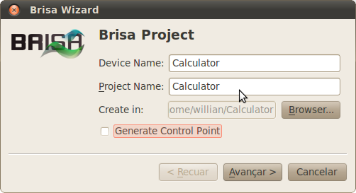

If desired, you can change the name of the Project, as shown below:

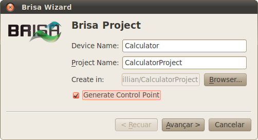

If you do not need to generate a Control Point for the Device, leave unchecked the option to Generate Control Point. The project by default is saved in the user's home directory, but if wanted the path can be changed by clicking on the "Browse..." button.

When the “next” button is clicked, the second page will appear asking for device information:

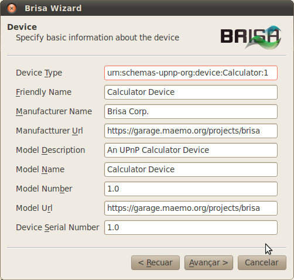

Based on what the user typed into the first page, suggestions are automatically generated for the fields in this page, if desired, the user can change them. This information will form the Calculator.h  file's constants, which will be generated when the wizard is finished.
	
After inputting the device information you can click “next” button and go to third page where you'll be requested for information about the services that are part of the Device. And again there will be suggested values for each field of each new service added. At the end each service will be related to one source, one header and one xml file.
	
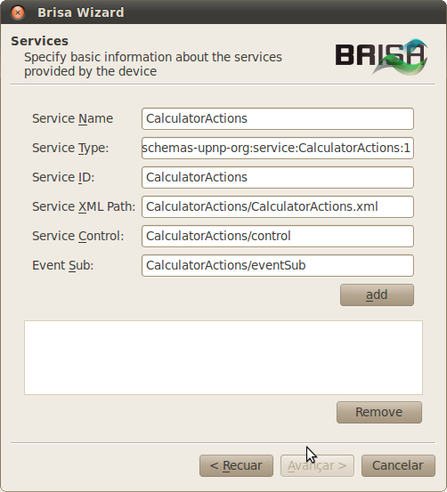

In this demonstration, only the service "CalculatorActions." was added. Advancing to the next page we inform the actions that constitute the Device Calculator:

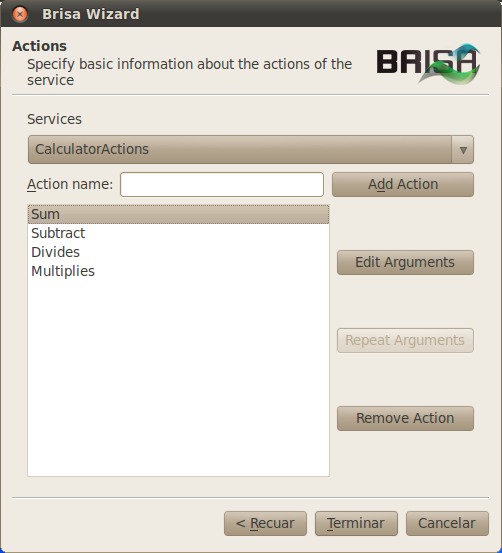

With all actions added, the next step is to define the arguments that each action. Double click on an action or select a desired action and click on the "Edit Arguments" button, the follow screen will appear:

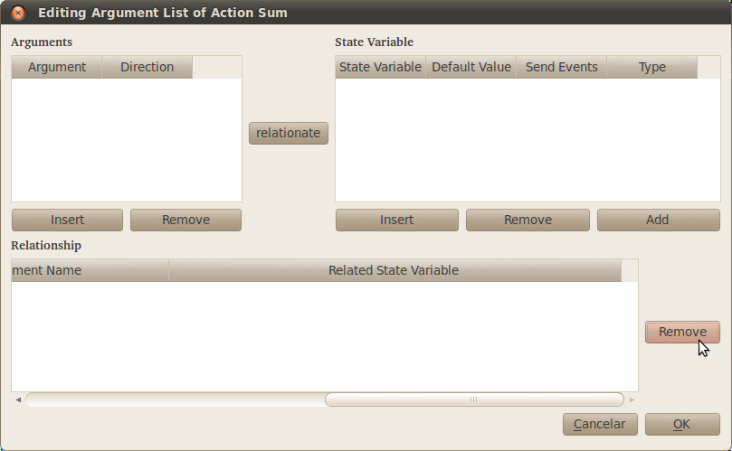

To insert a new argument click on the “Insert” button and a new line will appear on the list:

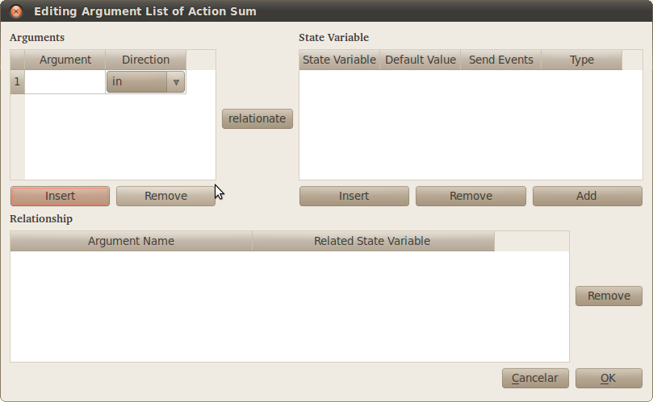

In this example we define two input arguments “Op1” and “Op2” and an output: “Result".

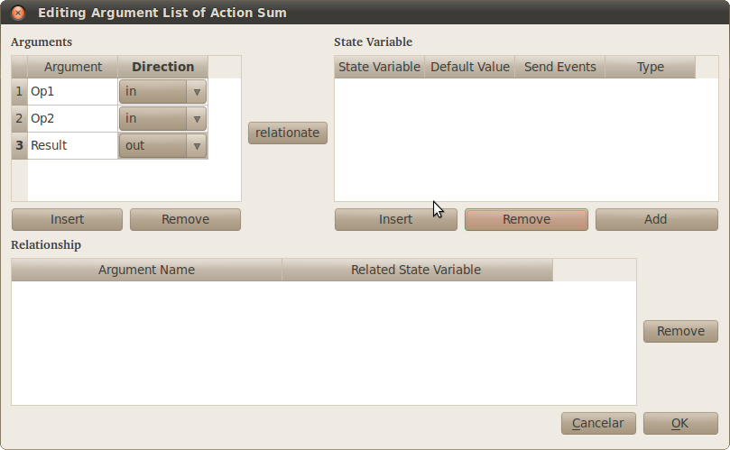

In next step we define the state variable with same name of the arguments. The field “Default Value” is optional, fill it in case you wish to have a default value of the corresponding state variable.

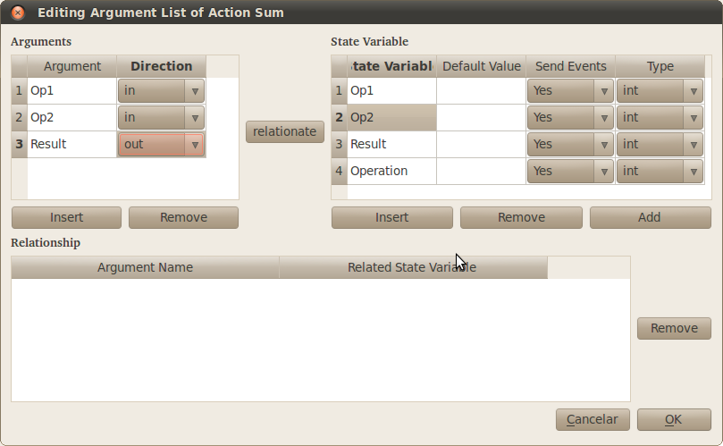

In next step we can link the arguments to state variable:

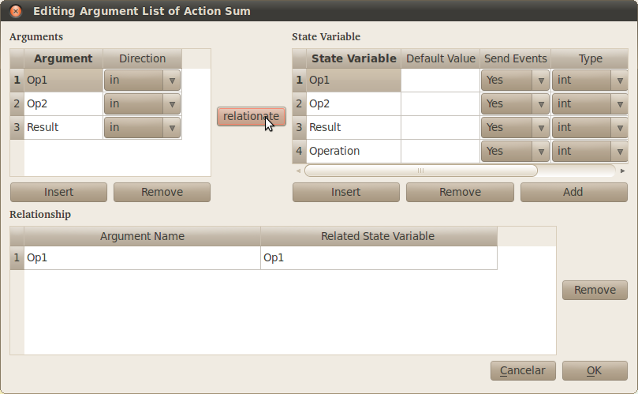

And repeat the same procedure to others arguments and state variables, as shown next.

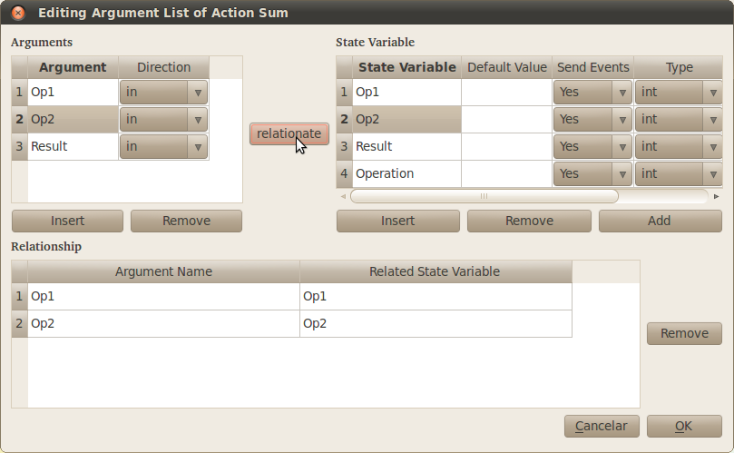

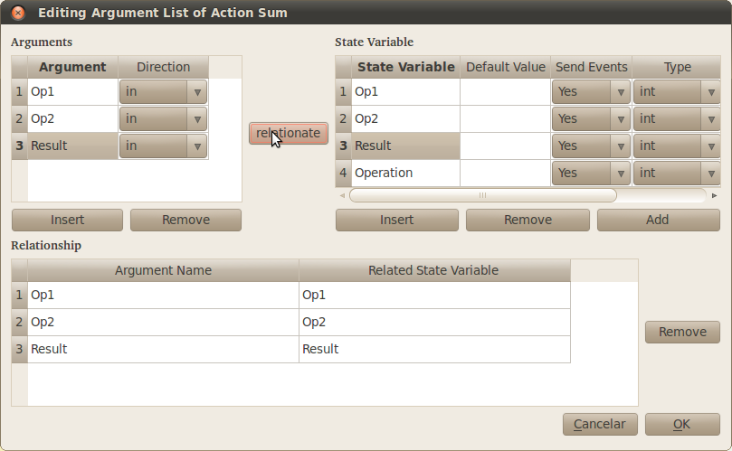

And we are done creating our calculator device. As we chose to generate a ControlPoint in the beginning of the wizard, two QtCreator projects will be opened at the end, as shown:

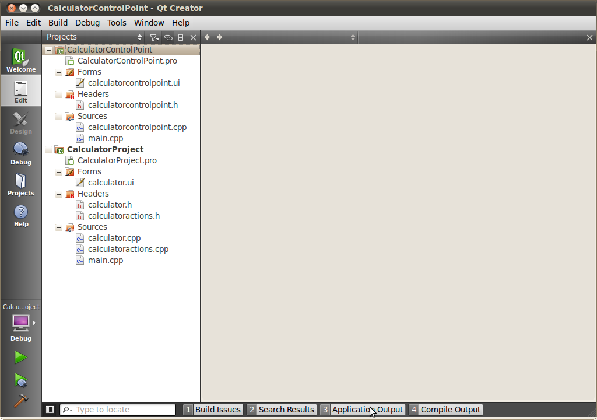

These projects are buildable. Running ControlPoint, will perform the action Sum, which is the first action defined by setting the input arguments to "1". On the application output appears that the Device variables "Op1", "Op2" were changed to the value 1 and the variable "Operation" was changed to "Sum". Then, the ControlPoint receives the concatenation of the values of "Op1" and "Op2" as the answer “11”. Chek the implementation of projects and ControlPoint Device:

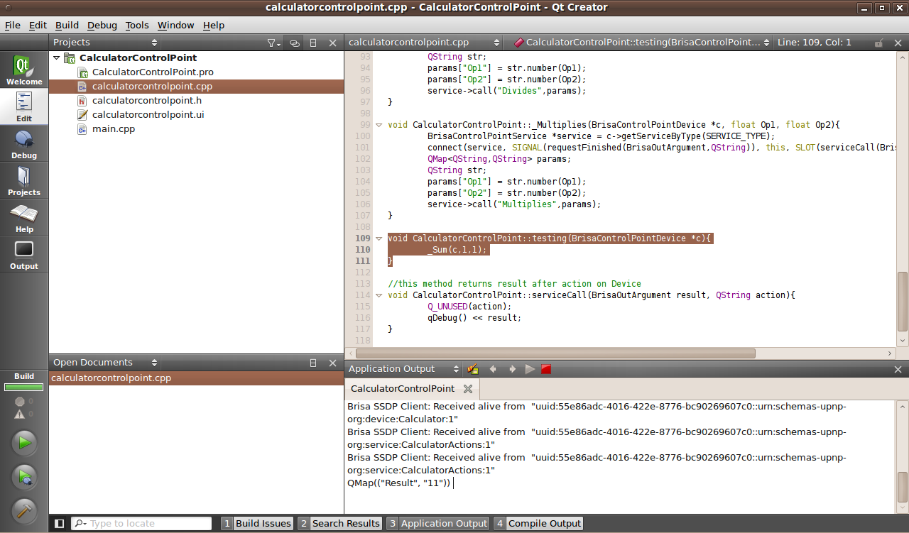
